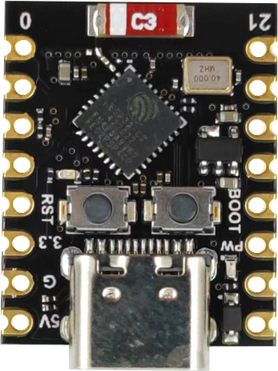
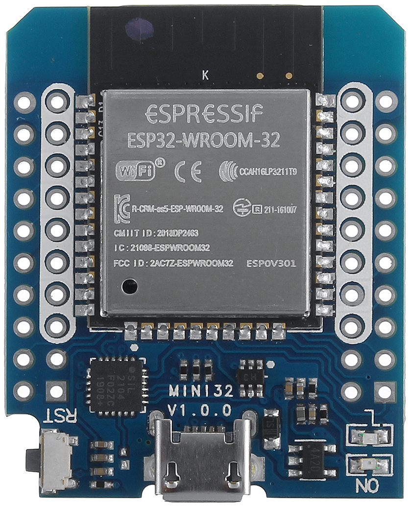
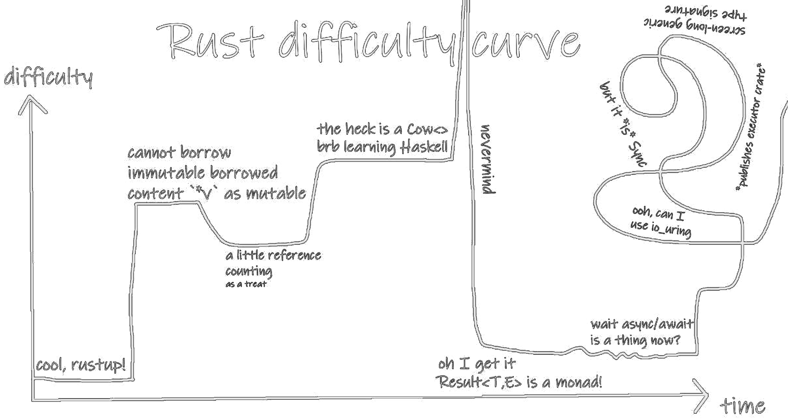
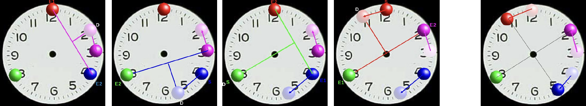

Who's here?
---

<!-- jump_to_middle -->

We'll be talking about **Rust** and **ESP32**.
Let's do a quick poll.

<!-- pause -->
<!-- incremental_lists: true -->
* Who has written **Rust** before?
* Who has developed for **MCUs** before?
* Who has written **Rust** code for **MCUs**?
<!-- incremental_lists: false -->

<!-- pause -->

You need to know neither of these topics to follow.

<!-- end_slide -->

Outline
---

<!-- jump_to_middle -->

1. `esp32` ?!
2. `rust` ?!
3. Implementing distributed coordination with the *Anti-Firefly Algorithm*

<!-- end_slide -->

Workshop Preparation
---

# For those participating
We brought ~20 ESP32 MCU's.

[](https://github.com/m-vz/rust-on-esp32) -> follow steps up to 5

# For those listening

The complete code is in the above repo and can be explored.

# For those that missed something

The presentation is in the same repo.
Feel free to ask questions at any time.
Q&A at the end for longer questions.

<!-- end_slide -->

ESP32
---
32-bit microprocessors by Espressif

<!-- column_layout: [1, 1] -->
<!-- column: 0 -->

# ESP32-C3 Super Mini
RISC-V, 1-core 160 MHz

**sometimes** 4 MiB flash

Pin compatible with ESP8266

<!-- new_lines: 2 -->



<!-- column: 1 -->

# ESP32-WROOM-32
Xtensa, 2-core 240 MHz

4 MiB flash



<!-- end_slide -->

Rust embedded
---

The ecosystem is growing rapidly. See [](https://github.com/rust-embedded/awesome-embedded-rust)

<!-- pause -->

# `rustc` Platform support
| Architecture | Support |                                |
|--------------|---------|--------------------------------|
| Bare *ARM*   | Tier 2  | *read "guaranteed to build"*   |
| *RISC-V*     | Tier 2  | *(ESP32-C, -H, and -P series)* |
| *AVR*        | Tier 3  | *supported but untested*       |
| *Xtensa*     | Tier 3  | *(ESP32 and ESP32-S series)*   |

Xtensa has open PRs in LLVM that need to be merged before official support can be improved.

<!-- end_slide -->

`std` and `no_std`
---

<!-- column_layout: [1, 1] -->
<!-- column: 0 -->
# `std`
Rust `std` (standard) library
<!-- new_line -->

Supported with `esp-idf` (layer between bare metal and program)

<!-- new_lines: 2 -->

Higher level -> power usage

<!-- column: 1 -->
# `no_std`
Rust `core` library \
(strict subset of `std`)

Supported by `esp-hal`, the *Hardware Abstraction Layer*

Runs on bare metal, no OS

No memory allocator -> No heap

Can be circumvented with custom allocators

<!-- pause -->

**We'll focus on this**

<!-- end_slide -->

Anatomy of an embedded Rust program
---

```rust +line_numbers
#![no_std]
#![no_main]

use esp_backtrace as _; // panic handler

#[entry]
fn main() -> ! {
    // setup code

    loop {
        // loop code
    }
}
```

<!-- end_slide -->

<!-- jump_to_middle -->

# C -> Rust
A rather contentious topic.

<!-- end_slide -->

C -> Rust
---

# Why
- Memory corruption can lead to hidden security issues and days to weeks of "blind" debugging.

> A fast language that crashes all the time
> is like a supercar ... that crashes all the time.
>
> ~ noboilerplate.org

- C *will* be replaced by a memory safe language. (fight me)

<!-- new_line -->

- The Rust type system is an absolute joy to work with!

<!-- end_slide -->

Rust type system
---

```rust {1-4|7-10|11-15|all} +line_numbers
fn increment(_cs: &CriticalSection) {
  // incrementing something
  // must happen atomically
}

fn main() {
  // compile time error
  increment();
//^^^^^^^^^-- an argument is missing

  // instead do
  interrupt::free(|cs| increment(cs));
  // critical section is dropped ---^ here
  // because it is local to the closure
}
```

<!-- end_slide -->

Iterators
---

```rust +line_numbers
let array = [0u16; 1'000'000];

// use
let max = array
    .iter()
    .max()
    .expect("The array is empty");

// instead of
let mut max = u16::MIN;
for i in 0..array.len() {
    if array[i] > max {
        max = array[i];
    }
}
```

<!-- end_slide -->

C -> Rust
---

# Why not #1


<!-- end_slide -->

C -> Rust
---

# Why not #2
> The compile times are so slow and the compiler is annoying.

<!-- end_slide -->

C -> Rust
---

# Why ~*not*~ #2
> The compile times are so slow and the compiler is annoying.

Let me present an alternative view:

> Programming with the Rust compiler is like pair-programming with someone on the Rust Compiler Team.

<!-- end_slide -->

Clippy
---

```rust +line_numbers
impl Add for Vec1 {
    type Output = Vec1;
    fn add(self, other: Vec1) -> Vec1 {
        Vec1(self.0 - other.0)
    }
}
```

<!-- pause -->

```sh
warning: suspicious use of `-` in `Add` impl
 --> src/main.rs:9:21
  |
9 |         Vec1(self.0 - other.0)
  |                     ^
```

<!-- end_slide -->

Questions?
---

<!-- jump_to_middle -->

milan@milan.wtf

[](https://github.com/m-vz/rust-on-esp32)

[](https://github.com/rust-embedded/awesome-embedded-rust)

[](https://docs.esp-rs.org)

<!-- end_slide -->

Anti-Firefly
---

```rust +line_numbers
pick random time_slot
loop once per round:
    send beacon at time slot
    update time_slot :=
        predecessor
        + average(predecessor, successor)
        + interval
```



 <!-- pause -->

[](https://github.com/m-vz/embedded-rust/commit/d648eb5)
